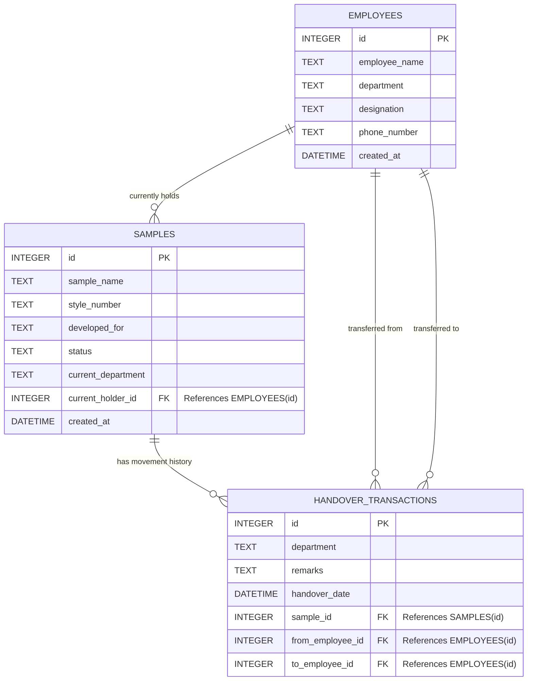

# Database Schema: Garment Sample Tracker

This is a visual representation of your SQLite database schema. You can use this during your interview to explain how the data is structured and how the tables relate to each other.

### How to Explain This Diagram:

1.  **The Masters:** On the top left, we have `EMPLOYEES` (Master Data). On the right, we have `SAMPLES` (Master Data). 
2.  **The Relationship:** A Sample points back to an Employee using `current_holder_id`. This makes it instantly queryable to see who has the garment right now without doing complex math.
3.  **The Transactions:** At the bottom is the `HANDOVER_TRANSACTIONS` ledger. Every time a sample moves, it creates one row here. It records the `sample_id` that moved, the `from_employee_id` who gave it, and the `to_employee_id` who received it. 

*Tip: Mentioning that you used **Foreign Keys (FK)** with "Cascade" and "Set Null" rules shows you understand proper relational database integrity!*
