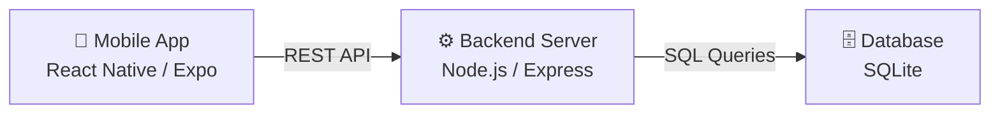
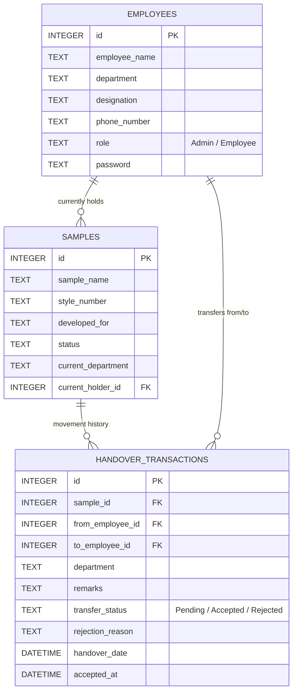
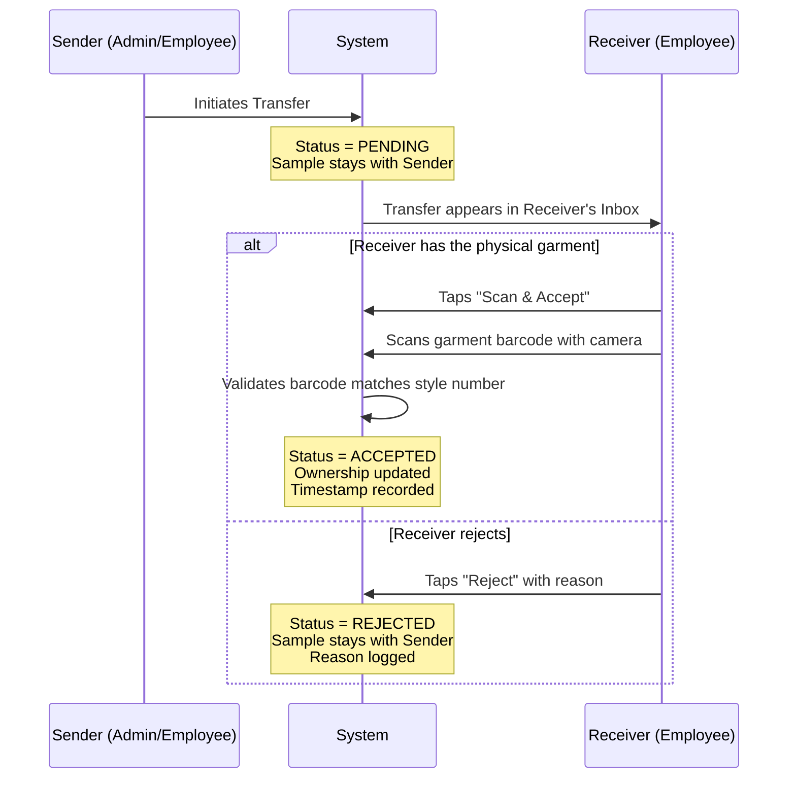

# Garment Sample Tracking System
### Project Report — Mobile Application

**Prepared by:** Abhinav  
**Date:** 19 May 2026  
**Version:** 1.0  

---

## 1. Executive Summary

The **Garment Sample Tracking System** is a mobile-first application designed to digitize the tracking and handover of garment samples across departments and employees. It replaces manual register-based tracking with a real-time, role-based, and verification-enabled digital workflow — ensuring full accountability, transparency, and traceability of every garment sample in the organization.

---

## 2. System Architecture

The application follows a **3-tier client-server architecture**:



| Layer | Technology | Purpose |
|-------|-----------|---------|
| Frontend | React Native (Expo SDK 54) | Cross-platform mobile UI |
| Backend | Node.js + Express.js | RESTful API server |
| Database | SQLite | Lightweight relational database |
| Tools | DB Browser for SQLite | Database management & testing |

---

## 3. Database Design

The database uses a relational schema with **Foreign Key constraints** to ensure data integrity.



> **Key Design Decision:** The `current_holder_id` is stored directly on the `samples` table for instant lookups, while the `handover_transactions` table maintains the complete audit trail.

---

## 4. Core Features

### 4.1 Authentication & Role-Based Access Control

The system implements two distinct user roles with different levels of access:

| Capability | Admin | Employee |
|-----------|-------|----------|
| Dashboard with global stats | ✅ | ❌ |
| Add/Edit Samples | ✅ | ❌ |
| Add/Edit Employees | ✅ | ❌ |
| Initiate Sample Transfers | ✅ | ✅ |
| Live Tracking & Search | ✅ | ✅ |
| My Workspace (personal inbox) | ❌ | ✅ |
| Accept/Reject Transfers | ❌ | ✅ |
| View Full Audit Trail | ✅ | ✅ |

- **Admin View:** 5 navigation tabs — Home, Samples, Transfers, Tracking, Employees
- **Employee View:** 3 navigation tabs — Home (Workspace), Transfers, Tracking

### 4.2 Two-Step Verified Handover Workflow

This is the core innovation of the application. Unlike a simple "transfer and done" system, every handover goes through a **two-step verification process**:



> **Why this matters:** This prevents fraudulent transfers. An employee cannot claim they received a garment without physically scanning its barcode tag. Every acceptance is timestamped and verifiable.

### 4.3 Barcode Scanning

The application supports scanning of industry-standard barcodes:

- **Supported Formats:** QR Code, EAN-13, EAN-8, Code128, Code39, UPC-A, UPC-E
- **Search by Scan:** Users can scan a garment tag from the Tracking screen to instantly view its full timeline
- **Verification Scan:** During acceptance, the scanned barcode must match the expected style number

### 4.4 Live Tracking & Search

A comprehensive tracking dashboard with:
- **Multi-field search** — search by sample name, style number, holder name, or department
- **Status filters** — In Development, In Production, QA Pending, Approved, Dispatched
- **Tabular layout** — professional table format with row numbers, sortable columns

### 4.5 Flipkart-Style Movement Timeline

Each garment sample has a detailed timeline page showing:
- **Sample Master Data** — name, style number, brand, current status
- **Current Holder** — employee name and department, with a quick "Transfer" button
- **Complete Movement History** — every handover event displayed chronologically with:
  - Sender → Receiver names
  - Department transferred to
  - Remarks
  - **Verification badge** (✓ Verified / ⏳ Pending / ✗ Rejected)
  - Sent timestamp and Accepted timestamp

### 4.6 Employee Workspace

A dedicated home screen for employees showing:
- **Pending Inbox** — transfers awaiting their acceptance, with red badge count
- **My Samples** — only the garments currently in their possession
- **Quick Stats** — sample count and pending count at a glance

---

## 5. API Endpoints

| Method | Endpoint | Description |
|--------|---------|-------------|
| POST | `/api/login` | Authenticate user |
| GET | `/api/dashboard` | Dashboard statistics |
| GET | `/api/employees` | List all employees |
| POST | `/api/employees` | Add new employee |
| PUT | `/api/employees/:id` | Update employee |
| GET | `/api/samples` | List all samples with holder |
| POST | `/api/samples` | Add new sample |
| PUT | `/api/samples/:id` | Update sample |
| POST | `/api/handover` | Initiate transfer (Pending) |
| POST | `/api/handover/:id/accept` | Accept transfer |
| POST | `/api/handover/:id/reject` | Reject transfer |
| GET | `/api/pending-transfers/:empId` | Get pending inbox |
| GET | `/api/my-samples/:empId` | Get employee's samples |
| GET | `/api/samples/:id/history` | Full movement timeline |

---

## 6. Security & Data Integrity

| Measure | Implementation |
|---------|---------------|
| Authentication | Password-based login against database |
| Role Enforcement | UI tabs hidden based on role; API-level separation |
| Transfer Integrity | Two-step accept with barcode verification |
| Audit Trail | Every action timestamped (sent, accepted, rejected) |
| Data Constraints | Foreign Keys with CASCADE and SET NULL rules |
| Rejection Logging | Rejection reason stored for dispute resolution |

---

## 7. Scalability Considerations

| Challenge | Solution |
|-----------|---------|
| Large employee/sample lists | Searchable modals with type-to-filter |
| Dashboard performance | Limited to 3 recent samples; full list on Tracking tab |
| List rendering | React Native `FlatList` with lazy rendering |
| Barcode lookup | Direct match against indexed `style_number` field |

---

## 8. Future Enhancements

The following features can be added in future versions:

1. **Push Notifications** — Alert employees when a transfer is pending their acceptance
2. **Photo Capture** — Attach garment photos during transfers for visual verification
3. **Cloud Deployment** — Migrate backend to cloud (AWS/GCP) for remote access
4. **Analytics Dashboard** — Charts for department-wise sample flow, average handover time
5. **Multi-Organization Support** — Tenant-based architecture for multiple garment units
6. **Offline Mode** — Queue transfers locally when network is unavailable

---

## 9. How to Run

### Prerequisites
- Node.js v18+
- Expo Go app on Android/iOS device
- Both devices on the same WiFi network

### Steps
```
# Terminal 1 — Start Backend
cd GarmentSampleTracker/backend
node server.js

# Terminal 2 — Start Mobile App
cd GarmentSampleTracker/mobile
npx expo start -c
```

### Test Credentials
| Name | Password | Role |
|------|----------|------|
| Abhinav | admin123 | Admin |
| Pranali | admin123 | Admin |
| Aniket | 1234 | Employee |
| Deepak | 1234 | Employee |

---

*This document is confidential and intended for internal review only.*
